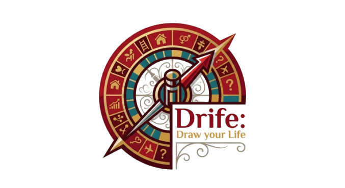

# 🎯 Drife: Draw your Life


> 🚀 **¡Ya podés jugar!** El proyecto es 100% funcional y está [subido a la web](https://drife-draw-your-life.onrender.com), aunque seguimos puliendo detalles y preparando nuevas características.

## 📖 Descripción
**Drife** es una aplicación web interactiva diseñada para crear, gestionar y girar ruletas de decisión personalizadas. 

La plataforma está pensada para esas situaciones en las que preferís dejar las decisiones en manos del azar, hacer sorteos, o simplemente divertirte. Al contar con un sistema de cuentas de usuario, cada persona tiene su propia "bóveda" de ruletas privadas y seguras en la nube.

### ✨ Características y Modalidades:
* **🎡 Ruleta común:** Probabilidad equitativa. Al girar, la suerte decide de forma totalmente aleatoria.
* **⚖️ Ruleta con pesos:** Cada opción puede tener una probabilidad personalizada (ej: 80% vs 20%). [En Desarrollo] 
* **☠️ Ruleta eliminatoria:** Ideal para sorteos; la opción ganadora se elimina del sistema tras cada giro. [En Desarrollo]
* **🤖 Generador IA:** ¿Te quedaste sin ideas? Drife se conecta con Inteligencia Artificial para crearte ruletas temáticas en segundos.
* **🔒 Seguridad RLS:** Tus ruletas son tuyas. El sistema de base de datos bloquea cualquier intento de acceso de otros usuarios a tus creaciones.

## 🛠️ Tecnologías Utilizadas


## 🚀 Estado Actual (Beta / MVP)
¡El proyecto ya está vivo y funcional en la web! Actualmente podés registrarte de forma segura, crear tus ruletas, generar opciones con Inteligencia Artificial y girarlas. 

Sin embargo, Drife es un proyecto en constante evolución. En este momento me encuentro trabajando en:
* Refinar animaciones y pulir las transiciones de la interfaz gráfica (UI/UX).
* Diseñar la lógica backend para las futuras modalidades de juego (Pesos y Eliminatoria), que **actualmente son solo conceptos en desarrollo**.

🤝 **¡Feedback bienvenido!** Estoy súper abierto a escuchar sugerencias, recibir correcciones de código, o debatir nuevas ideas para seguir escalando el proyecto. Si ves algo que se puede mejorar, ¡avisame!

## 🗺️ Roadmap / Tareas Pendientes
- [x] Estructura base y despliegue del entorno web (Render).
- [x] Conexión robusta con Supabase (Autenticación + Base de Datos).
- [x] Implementación de políticas de seguridad nivel servidor (RLS).
- [x] Integración de la API de Google Gemini para creación automática.
- [ ] **[WIP]** Refinamiento visual y animaciones avanzadas en Flet.
- [ ] Desarrollo lógico y visual: Modalidad "Ruleta con pesos".
- [ ] Desarrollo lógico y visual: Modalidad "Ruleta eliminatoria".

## ⛃ Arquitectura de Base de Datos
La base de datos evolucionó a **PostgreSQL** (gestionada mediante Supabase). Está normalizada y utiliza identificadores únicos universales (`UUID`) para garantizar que la conexión con la bóveda de autenticación (`auth.users`) sea impenetrable. 

Además, todas las tablas están protegidas con **Row Level Security (RLS)**, garantizando que ninguna consulta pueda leer o escribir datos que no pertenezcan al usuario logueado.

    users {
        uuid user_id [PK, FK -> auth.users.id]
        text user_name
        text email
    }

    roulettes {
        uuid roulette_id [PK]
        uuid user_id [FK -> users.user_id]
        text name_roulette
    }

    options {
        uuid option_id [PK]
        uuid roulette_id [FK -> roulettes.roulette_id]
        text option_name
    }

## 📁 Estructura del Proyecto

```text
drife/
├── Assets/                 # Imágenes de la app y favicon
├── Roulette/               # Lógica y Vistas de las Ruletas
│   ├── Gameplay/
│   │   └── play.py         # Motor principal del juego y giros
│   ├── Options/
│   │   └── create_menu.py  # Menú para crear las porciones de la ruleta
│   │   └── crud.py         # Comunicación con la base de datos (Opciones)
│   ├── crud.py             # Comunicación con la base de datos (Ruletas)
│   ├── main_menu.py        # Dashboard/Menú principal de ruletas
│   └── roulette_menu.py    # Interfaz visual de la ruleta
├── Users/                  # Sistema de Usuarios y Autenticación
│   ├── crud.py             # Conexión con Supabase Auth y Tabla Users
│   ├── login_menu.py       # Interfaz visual de Iniciar Sesión
│   └── register_menu.py    # Interfaz visual de Registro
├── Utilities/
│   └── helpers.py          # Atajos para simplificar los archivos
├── .env                    # Llaves secretas (Ignorado en GitHub por seguridad)
├── .gitignore              # Reglas de exclusión para Git
├── main.py                 # Punto de entrada de la aplicación Flet
├── README.md               # Documentación del proyecto
└── requirements.txt        # Dependencias necesarias para Render